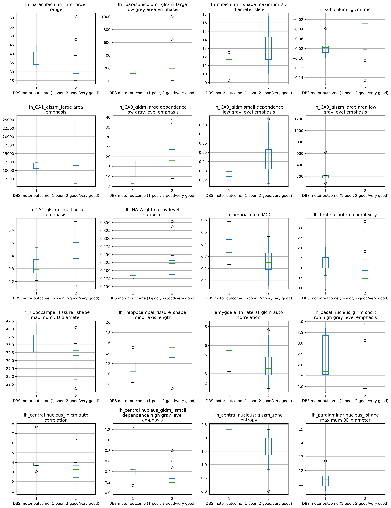
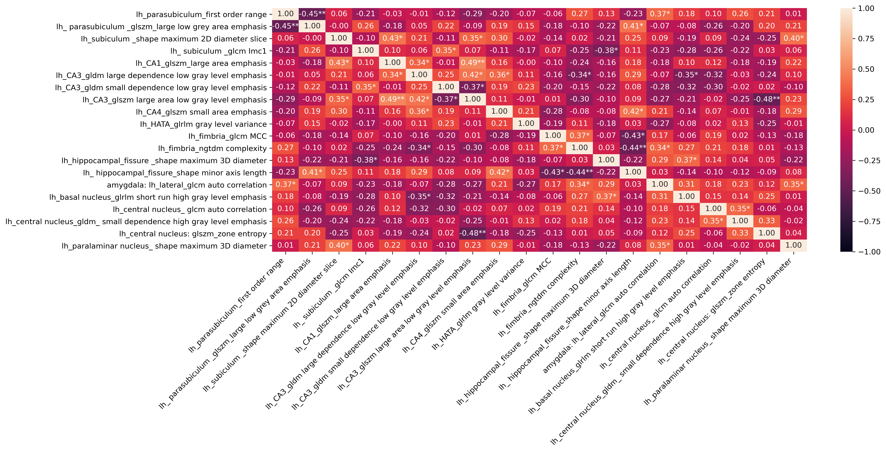
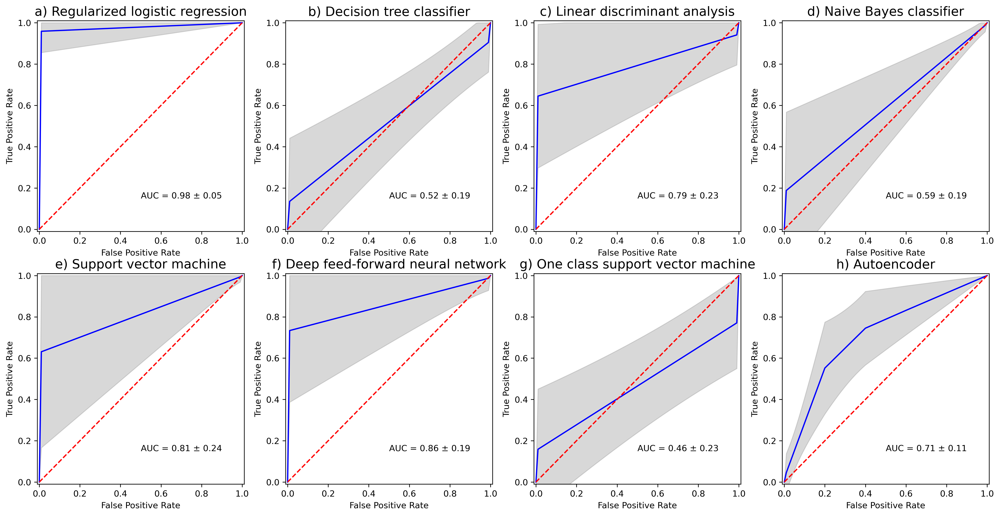

# PD_Motor_Outcomes_post_DBS
 
Publishing the whole codebase for "Radiomic features of amygdala nuclei and hippocampus subfields help to predict deep brain stimulation motor outcomes for Parkinson‘s disease patients" paper. The requirements are found in [requirements.txt](requirements.txt)

NOTE: The codebase is extremely messy due to rapid solo development. Some minor data preparation tasks were done by hand (will be outlined in the relevant parts).

The overall goal of the paper is prediction of post DBS motor complications from pre DBS radiomics data.

The folder [data_preparation](data_preparation) contains the code used for preparing the data (transforming feature matricies, joining different files together, etc.). The script inside the folder [data_preparation.py](data_preparation/data_preparation.py) won't work because some of the required files were deleted (due to patient confidencielity concerns). The final data file used for further analysis generated by this script is called [Final_Data_index.csv](data_preparation/Final_Data_index.csv). Radiomics feature files are found in the folder [data_preparation/data](data_preparation/data).

The folder [data_analysis](data_analysis) contains all the files and scripts that produced the results in the paper. The scripts should be ran in this order:
1. [pearson_ftest_anova_MRMR.py](data_analysis/pearson_ftest_anova_MRMR.py) This script produces the features used in the paper into the file called [MRMR2.csv](data_analysis/MRMR2.csv) using the MRMR feature selection algorightm (Pearson correlation for redundancy and one-way ANOVA F-test for relevance). This file is then transformed into [MRMR_2.csv](data_analysis/MRMR_2.csv) by hand, by changing the labels from the encoded shortened form to the original. For this step there is another MRMR feature selection script [spearman_kruskall_wallis_MRMR.py](data_analysis/spearman_kruskall_wallis_MRMR.py) which selects features using the MRMR algorigthm with Spearman corelation for redundancy and Kruskal–Wallis test for relevance. Both scripts produce features from the left hemisphere (lh) although the features themselves are different. To reiterate features used in the paper are produced by the script [pearson_ftest_anova_MRMR.py](data_analysis/pearson_ftest_anova_MRMR.py).
2. [model_classification.py](data_analysis/model_classification.py) performs model training and predictions for different models and saves the results into files with a \*.npy ending. It performs these actions using the file [MRMR_2.csv](data_analysis/MRMR_2.csv) containing the selected features.
3. [draw_ROCs.py](data_analysis/draw_ROCs.py), [draw_correlation_heatmap.py](data_analysis/draw_correlation_heatmap.py) and [draw_boxplots.py](data_analysis/Graphing/draw_boxplots.py) produces the figures seen in the paper in a ".tif" format.

Graphics found in the paper are in the [graphs](graphs) folder.

Boxplots:

Correlation heatmap:

ROCs:

